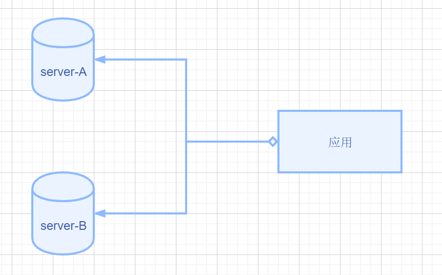
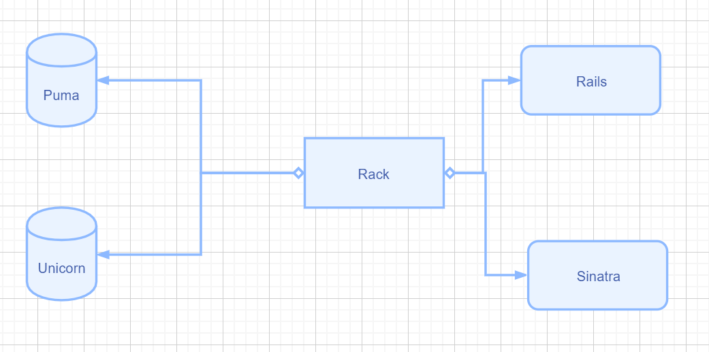
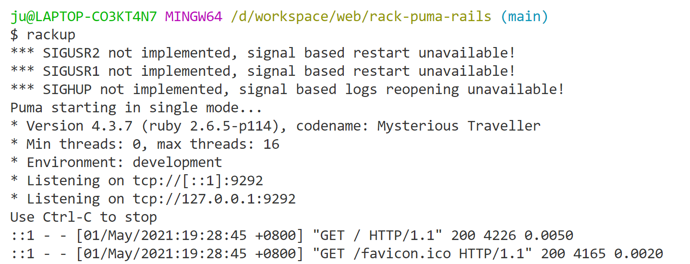

# rack puma rails

## 背景

2021 年 五一, 突然对 web server 产生了兴趣,
好奇我们的程序是如何接收到请求, 找到我们的程序代码,并返回对应的结果的;

于是, 便写下这篇文章;

## 说明

文章所涉及到的代码已上传 [GitHub rack-puma-rails](https://github.com/ShisiJu/rack-puma-rails)

文章涉及到的程序版本

- [rack 2.2](https://github.com/rack/rack)
- [puma 5.1](https://github.com/puma/puma)
- [rails 6.1](http://rubyonrails.org/)

文中提到的 web server 是指的服务器软件, 而非计算机.

## 简述

rack 是一个 ruby web server(例如: puma, unicorn) 和 应用程序(例如: rails)之间的桥梁;

## rack


### Rack 是什么

Rack 提供了一个最小化的, 模块化, 可适配化的接口给 Ruby 的 web 应用;

通过简单的方式封装 HTTP 请求和响应, Rack 统一并提取了 API 给 web server,
web 框架以及在两者之间的中间件(middleware).

### 为什么要使用 Rack

在没有 Rack 之前, web server 的实现各有千秋, web 应用对接不同的 web server,
需要一个 server 对应一套逻辑; 缺乏统一的标准;



这些适配不同 server 的工作, 没有太大意义, 人们期望有一个统一的规范, 能够让 web server 和
web 应用可以随意组合, 且只需要简单的配置.

Rack 的出现解决了 web server 和 web 应用之间配置的问题;

> 复杂的程序需要分层

通过 Rack, 不同的 web server 和 不同的应用框架可以非常简单地集成;



接下来, 我们就来详细看一下 Rack 的协议和中间件.

### Rack 协议与中间件

Rack 作为 web server 与应用框架之间的桥梁.
最为重要的就是定义一套清晰的`协议(protocol)`.

#### Rack 协议

我们也可以使用 Rack 的中间件

我们先来看一下[rack 协议](https://github.com/rack/rack/blob/master/SPEC.rdoc)

- 对于 `web server`: 只需要在 `Rack::Handler` 的模块中创建一个实现了 `run` 方法的类就可以了
- 对于 `web 框架`: 需要有一个 Ruby 的对象(注意不是类). 这个对象需要实现`call`方法.
  - call 方法`只有一个`参数 `env` 环境
  - 返回一个数组, 数组必须返回是三个值. 分别是 HTTP 的 status , headers, 和 body

> Rack 的协议脱胎于 python 的[pep-0333 Python Web Server Gateway Interface](https://www.python.org/dev/peps/pep-0333/)

我们可以看一个小案例, 来看一下具体的情况;

要确保已安装了 `rack` 和 `puma`

我们在 `config.ru` 简单写一个处理请求的 rack 对象

```rb
# config.ru rack的默认配置文件
# rack对象, 接收一个env参数, 且要返回一个数组
APP = ->(env) { [200, {}, [env.inspect]] }
run ->(env) { APP.call(env) }
```

执行`rackup`

```sh
rackup
```



我们可以看到 `rackup`执行之后, `puma` 也随之启动了!

我们可以在浏览器中看一下效果 [http://localhost:9292/hello_world](http://localhost:9292/hello_world)

在浏览器中可以看到打印的`env`对象

接下来, 我们看看`rackup`到底做了什么, 能够让 puma 运行起来;

```sh
$ which rackup
/d/env/ruby/Ruby26-x64/bin/rackup
```

我们来看一下对应的代码

```rb
# gem自动生成的文件, 方便使用, 省去了一些代码
version = ">= 0.a"
load Gem.activate_bin_path('rack', 'rackup', version)
```

我们在`pry`执行一下看看

```sh
[1] pry(main)> require 'rubygems'
=> false
[2] pry(main)> version = ">= 0.a"
=> ">= 0.a"
[3] pry(main)> Gem.activate_bin_path('rack', 'rackup', version)
=> "D:/env/ruby/Ruby26-x64/lib/ruby/gems/2.6.0/gems/rack-2.2.3/bin/rackup"
```

我们找到对应的`bin/rackup`的代码

```rb
require "rack"
Rack::Server.start
```

我们在 pry 中看一下具体执行的位置

```sh
[1] pry(main)> require "rack"
=> true
[2] pry(main)> show-source Rack::Server.start

From: D:/env/ruby/Ruby26-x64/lib/ruby/gems/2.6.0/gems/rack-2.2.3/lib/rack/server.rb @ line 167:
Owner: #<Class:Rack::Server>
Visibility: public
Number of lines: 3

def self.start(options = nil)
  new(options).start
end
```

我们再看一下代码`lib/rack/server.rb`

```rb
def self.start(options = nil)
  new(options).start
end

def start(&block)
  # 调用server.run
  server.run(wrapped_app, **options, &block)
end

# 我们没有传server的参数, 因此会去尝试默认的server
def server
  @_server ||= Rack::Handler.get(options[:server])

  unless @_server
    # SERVER_NAMES = %w(puma falcon webrick).freeze
    @_server = Rack::Handler.default

    # We already speak FastCGI
    @ignore_options = [:File, :Port] if @_server.to_s == 'Rack::Handler::FastCGI'
  end

  @_server
end
```

```sh
[3] pry(main)> Rack::Handler.default
=> Rack::Handler::Puma
```

我们可以看到, server 的值是 `Rack::Handler::Puma`

那么, 最终的效果是

```rb
Rack::Handler::Puma.run(wrapped_app, **options, &block)
```

参数 `wrapped_app` 是一个非常重要的参数, 里面包含了中间件.
我们接下来, 好好看一下!

#### rack 中间件

```rb
def wrapped_app
  @wrapped_app ||= build_app app
end

# options 方法是一个hash对象, 是一些配置, 如果不传, 则取默认配置
def build_app(app)
  middleware[options[:environment]].reverse_each do |middleware|
    middleware = middleware.call(self) if middleware.respond_to?(:call)
    next unless middleware
    klass, *args = middleware
    app = klass.new(app, *args)
  end
  app
end

def app
  @app ||= options[:builder] ? build_app_from_string : build_app_and_options_from_config
end

private
  def build_app_and_options_from_config
    if !::File.exist? options[:config]
      abort "configuration #{options[:config]} not found"
    end
    # 默认的文件是 config.ru
    return Rack::Builder.parse_file(self.options[:config])
  end
```

通过上述代码, 可以知道方法 app 的返回结果是通过解析`config.ru`文件获取的

```rb
Rack::Builder.parse_file('config.ru')
```

```rb
# Initialize a new Rack::Builder instance.  +default_app+ specifies the
# default application if +run+ is not called later.  If a block
# is given, it is evaluted in the context of the instance.
def initialize(default_app = nil, &block)
  @use, @map, @run, @warmup, @freeze_app = [], nil, default_app, nil, false
  instance_eval(&block) if block_given?
end
```

`instance_eval(&block)` 通过 ruby 的元编程, 从而以`Rack::Builder`实例对象, 来调用`config.ru`中的代码;

```rb
APP = ->(env) { [200, {}, [env.inspect]] }
use Rack::CommonLogger
run ->(env) { APP.call(env) }
```

等价于

```rb
app = Rack::Builder.new
APP = ->(env) { [200, {}, [env.inspect]] }
# 添加要使用的中间件
app.use Rack::CommonLogger
# 这里的 run 和 Rack::Handler::Puma.run 只是同样的名字
app.run APP
```

```rb
# Specifies middleware to use in a stack.
#
#   class Middleware
#     def initialize(app)
#       @app = app
#     end
#
#     def call(env)
#       env["rack.some_header"] = "setting an example"
#       @app.call(env)
#     end
#   end
#
#   use Middleware
#   run lambda { |env| [200, { "Content-Type" => "text/plain" }, ["OK"]] }
#
# All requests through to this application will first be processed by the middleware class.
# The +call+ method in this example sets an additional environment key which then can be
# referenced in the application if required.
def use(middleware, *args, &block)
  if @map
    mapping, @map = @map, nil
    @use << proc { |app| generate_map(app, mapping) }
  end
  @use << proc { |app| middleware.new(app, *args, &block) }
end
```

## puma

puma-master\lib\puma\rack_default.rb

```rb
require 'rack/handler/puma'

module Rack::Handler
  def self.default(options = {})
    Rack::Handler::Puma
  end
end
```

puma-master\lib\rack\handler\puma.rb

所有遵循 Rack 协议的 webserver 都会实现上述 .run 方法接受 app、options 和一个 block 作为参数运行一个进程来处理所有的来自用户的 HTTP 请求，在这里就是每个 webserver 自己需要解决的了

```rb
require 'rack/handler'

# 省略了很多配置的代码
module Rack
  module Handler
    module Puma
      DEFAULT_OPTIONS = {
        :Verbose => false,
        :Silent  => false
      }

      # 注册rack服务器名称
      register :puma, Puma
      def self.run(app, **options)
        conf   = self.config(app, options)
        events = options.delete(:Silent) ? ::Puma::Events.strings : ::Puma::Events.stdio
        launcher = ::Puma::Launcher.new(conf, :events => events)

        yield launcher if block_given?
        begin
          launcher.run
        rescue Interrupt
          puts "* Gracefully stopping, waiting for requests to finish"
          launcher.stop
          puts "* Goodbye!"
        end
      end
    end
  end
end
```

```
bundle exec puma
```

常见的 rack 服务器

- puma (rails 默认的 web server)
- unicorn
- webrick (rack 自带的)

https://en.wikipedia.org/wiki/Mastodon_(software)

[puma](https://puma.io/)

Puma was born from [Mongrel](<https://en.wikipedia.org/wiki/Mongrel_(web_server)>) and began moving forward.

Unlike other Ruby Webservers, Puma was built for speed and parallelism. Puma is a small library that provides a very fast and concurrent HTTP 1.1 server for Ruby web applications. It is designed for running Rack apps only.

What makes Puma so fast is the careful use of a [Ragel](https://en.wikipedia.org/wiki/Ragel) extension to provide fast, accurate HTTP 1.1 protocol parsing. This makes the server scream without too many portability issues.

## rails

rails 是基于 rack 的

rails-6-1-stable\railties\lib\rails\cli.rb

rails-6-1-stable\railties\lib\rails\commands\server\server_command.rb

```rb
def use_puma?
  server.to_s == "Rack::Handler::Puma"
end
```

```sh
rails server
```

## 总结

## 参考文档

- [a-simple-intro-to-writing-a-lexer-with-ragel](http://thingsaaronmade.com/blog/a-simple-intro-to-writing-a-lexer-with-ragel.html)
- [rubyguides rack-middleware](https://www.rubyguides.com/2018/09/rack-middleware/)
- [谈谈 Rack 的协议与实现](https://draveness.me/rack/)
- [rails_on_rack](https://guides.rubyonrails.org/rails_on_rack.html)
- [passenger-vs-puma](https://stackshare.io/stackups/passenger-vs-puma)
- [why-to-use-puma-in-production-for-your-rails-app](https://dev.to/anilmaurya/why-to-use-puma-in-production-for-your-rails-app-44ga)
- [thoughtbot rack](https://thoughtbot.com/upcase/videos/rack)
